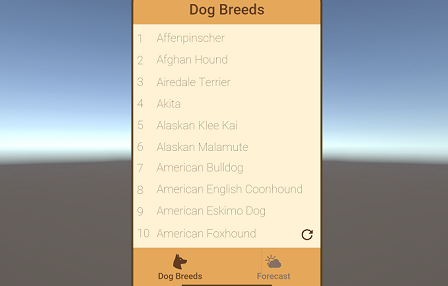

Unity Web Request Demo
=====

This mini application requests and displays data on the screen, featuring two tabs: one for showing weather information and another for dog breeds. The app fetches real-time data and updates the content accordingly.